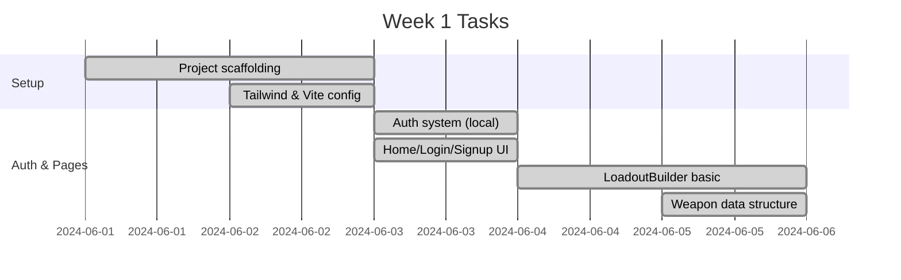
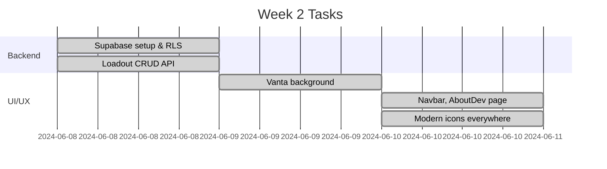
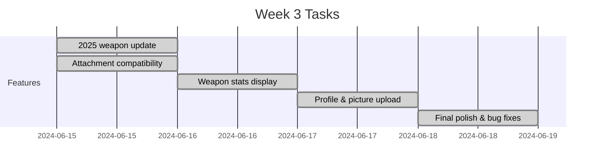
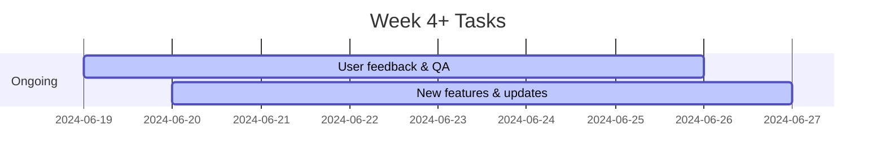

# CoDM Loadout Linker - Project Documentation

## Overview
CoDM Loadout Linker is a modern web application for Call of Duty: Mobile players to create, customize, and share their ultimate loadouts. Built with React, TypeScript, Tailwind CSS, and Supabase, the app features a beautiful animated background, robust authentication, and a rich weapon customization system.

## Core Features
- **User Authentication:** Login, Signup, Email Verification, Loading States
- **User Profile:** Dashboard, Picture Upload, Settings, Form Validation
- **Weapon System:** Data structures for weapons, attachments, and loadout saving
- **Weapon Categories:** Assault Rifles, SMGs, LMGs, Sniper Rifles, Shotguns, Marksman
- **Advanced Customisation:** Attachments (Optics, Muzzles, Barrels, Stocks, Perks, etc.)
- **Compatibility Logic:** Ensures only valid attachments per weapon
- **Weapon Statistics:** Visual display of weapon stats and attachment impact
- **2025 Update:** New weapons (XM4, RAM-7), updated stats, improved UI
- **Animated Background:** Vanta.js NET effect, always visible
- **Shareable Loadouts:** Unique URLs, public viewing via Supabase
- **Modern UI:** Consistent iconography, responsive design, themed components

## Architecture
```mermaid
flowchart TD
  subgraph UI_Layer
    A1[Login/Signup Page]
    A2[Profile Page]
    A3[LoadoutBuilder Page]
    A4[LoadoutViewer Page]
    A5[WeaponSelector / PerkSelector / ScorestreakSelector]
    A6[UserProfile / Settings / PictureUpload]
    A7[WeaponStatsDisplay]
  end
  subgraph Context_and_State
    B1[AuthContext]
    B2[useToast, useMobile]
  end
  subgraph Services_and_Data
    C1[LoadoutService (Supabase CRUD)]
    C2[weapons.ts, perks.ts, scorestreaks.ts]
    C3[utils.ts (compatibility logic)]
  end
  D1[Supabase DB]
  A1 -- login/signup --> B1
  A1 -- loading, error --> B2
  A2 -- profile data --> B1
  A2 -- update profile --> C1
  A2 -- upload picture --> C1
  A3 -- select weapon/perks/scorestreaks --> A5
  A3 -- save loadout --> C1
  A3 -- validate form --> B2
  A3 -- show stats --> A7
  A5 -- fetch data --> C2
  A5 -- validate compatibility --> C3
  A7 -- display stats --> C2
  A7 -- show impact of attachments --> C3
  A4 -- fetch loadout --> C1
  B1 -- auth state --> A1
  B1 -- user info --> A2
  C1 -- CRUD loadouts --> D1
  C1 -- fetch user profile --> D1
  C2 -- weapon/category data --> A5
  C3 -- compatibility logic --> A5
  C2 -- 2025 update: new weapons, stats --> A5
  classDef db fill:#222,stroke:#ffa500,stroke-width:2px;
  class D1 db;
```

---

## Weekly Tasks & Updates

### Week 1
**Summary:**
- Project setup (React, Vite, Tailwind, TypeScript)
- Initial authentication (local, then Supabase)
- Basic Home, Login, Signup, and LoadoutBuilder pages
- Initial weapon data and loadout structure



### Week 2
**Summary:**
- Supabase integration for persistent loadouts
- Public sharing via unique URLs
- Animated Vanta background
- Improved UI/UX, added iconography



### Week 3
**Summary:**
- 2025 weapon update (XM4, RAM-7, stats)
- Compatibility logic for attachments
- Weapon stats display
- Profile dashboard, picture upload
- Final polish and bug fixes



### Week 4+
**Summary:**
- Ongoing improvements, user feedback, and new features.

